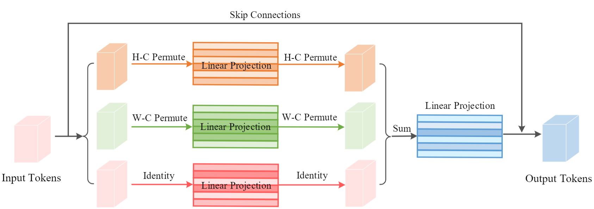

# Vision Permutator: A Permutable MLP-Like Architecture for Visual Recognition

This is a Pytorch implementation of our paper. We present Vision Permutator, a conceptually simple and data efficient
MLP-like architecture for visual recognition. We show that our Vision Permutators are formidable competitors to convolutional neural
networks (CNNs) and vision transformers. 

We hope this work could encourage researchers to rethink the way of encoding spatial
information and facilitate the development of MLP-like models.



Basic structure of the proposed Permute-MLP layer. The proposed Permute-MLP layer contains
three branches that are responsible for encoding features along the height, width, and channel
dimensions, respectively. The outputs from the three branches are then combined using element-wise addition, followed by a fully-connected layer for feature fusion.

Our code is based on the [pytorch-image-models](https://github.com/rwightman/pytorch-image-models) and [Token Labeling](https://github.com/zihangJiang/TokenLabelinghttps://github.com/rwightman).

### Comparison with Recent MLP-like Models

| Model                | Parameters | Throughput | Image resolution | Top 1 Acc. | Download |
| :------------------- | :--------- | :--------- | :--------------- | :--------- | :------- |
| EAMLP-14             | 30M        | 711 img/s  |       224        |  78.9%     |          |
| gMLP-S               | 20M        | -          |       224        |  79.6%     |          |
| ResMLP-S24           | 30M        | 715 img/s  |       224        |  79.4%     |          |
| ViP-Small/7 (ours)   | 25M        | 719 img/s  |       224        |  81.5%     | [link](https://drive.google.com/file/d/1cX6eauDrsGsLSZnqsX7cl0oiKX8Dzv5z/view?usp=sharing) |
| EAMLP-19             | 55M        | 464 img/s  |       224        |  79.4%     |          |
| Mixer-B/16           | 59M        | -          |       224        |  78.5%     |          |
| ViP-Medium/7 (ours)  | 55M        | 418 img/s  |       224        |  82.7%     | [link](https://drive.google.com/file/d/15y5WMypthpbBFdc01E3mJCZit7q0Yn8m/view?usp=sharing) |
| gMLP-B               | 73M        | -          |       224        |  81.6%     |          |
| ResMLP-B24           | 116M       | 231 img/s  |       224        |  81.0%     |          |
| ViP-Large/7          | 88M        | 298 img/s  |       224        |  83.2%     | [link](https://drive.google.com/file/d/14F5IXGXmB_3jrwK33Efae-WEb5D_G85c/view?usp=sharing) |

The throughput is measured on a single machine with V100 GPU (32GB) with batch size set to 32.

### Requirements

torch>=1.4.0
torchvision>=0.5.0
pyyaml
timm==0.4.5

data prepare: ImageNet with the following folder structure, you can extract imagenet by this [script](https://gist.github.com/BIGBALLON/8a71d225eff18d88e469e6ea9b39cef4).

```
│imagenet/
├──train/
│  ├── n01440764
│  │   ├── n01440764_10026.JPEG
│  │   ├── n01440764_10027.JPEG
│  │   ├── ......
│  ├── ......
├──val/
│  ├── n01440764
│  │   ├── ILSVRC2012_val_00000293.JPEG
│  │   ├── ILSVRC2012_val_00002138.JPEG
│  │   ├── ......
│  ├── ......
```

### Validation
Replace DATA_DIR with your imagenet validation set path and MODEL_DIR with the checkpoint path
```
CUDA_VISIBLE_DEVICES=0 bash eval.sh /path/to/imagenet/val /path/to/checkpoint
```

### Training

Command line for training on 8 GPUs (V100)
```
CUDA_VISIBLE_DEVICES=0,1,2,3,4,5,6,7 ./distributed_train.sh 8 /path/to/imagenet --model vip_s7 -b 256 -j 8 --opt adamw --epochs 300 --sched cosine --apex-amp --img-size 224 --drop-path 0.1 --lr 2e-3 --weight-decay 0.05 --remode pixel --reprob 0.25 --aa rand-m9-mstd0.5-inc1 --smoothing 0.1 --mixup 0.8 --cutmix 1.0 --warmup-lr 1e-6 --warmup-epochs 5
```

### License
This repository is released under the MIT License as found in the [LICENSE](LICENSE) file.
